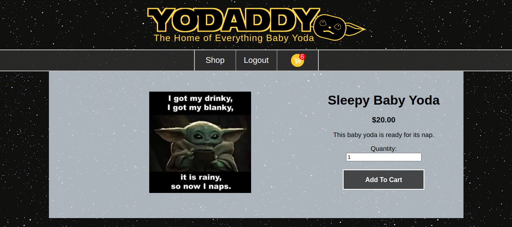
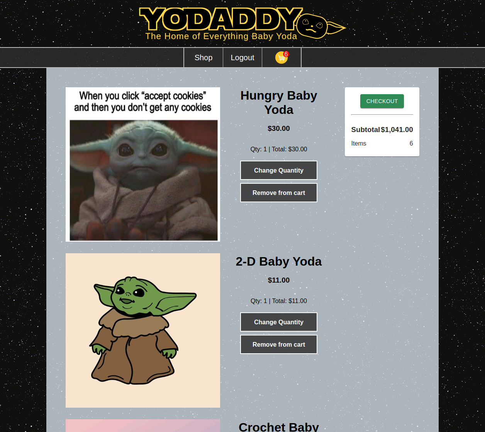
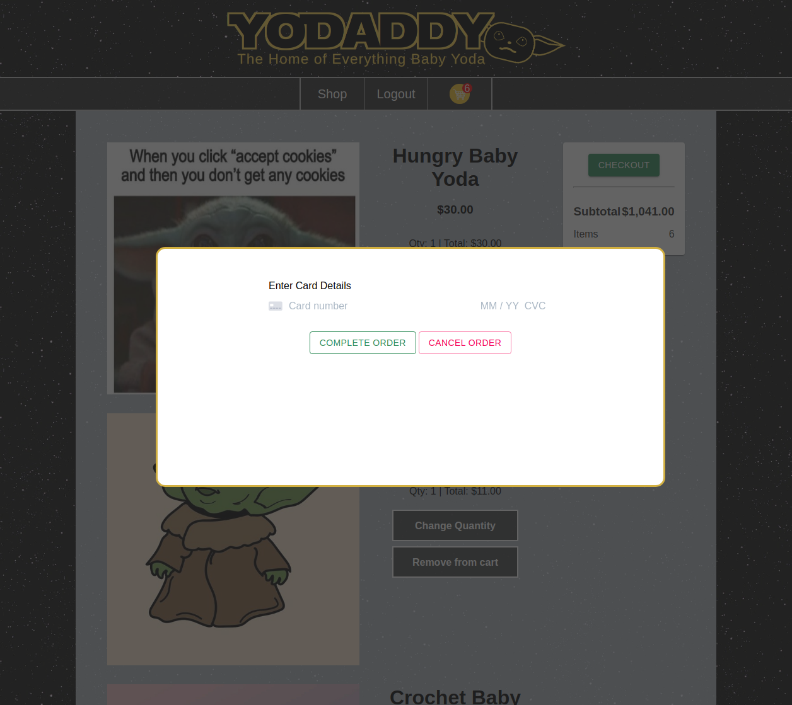
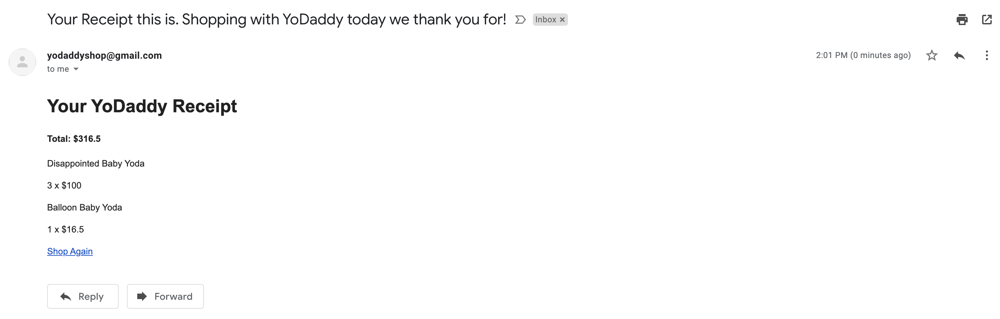

# YoDaddy


eCommerce site attempting to fill the world's insatiable need for all things Baby Yoda (Grogu). We closely followed and emulated the top online shopping experiences to deliver our fun, original website. Highlight features include:

* Fully functioning checkout enabled with Stripe API (test it out with test card #: 4242x4 - use any EXP and CVV)
* Upon successful checkout, sends email receipt - Nodemailer API
* Sign Up or Login with Google, enabled using Passport API
* Shop and checkout while logged in, or as a guest. Logging in merges cart from local storage to your account in our Postgres database
* Edit item quantity and remove from cart
* Authorized admin-only routes and features (edit, delete, or add new product; view users' info)
* Responsive design - compatible with mobile devices
* Custom logo! (Made by David Huang)
* Baby Yodas for days
* Customized welcome messages with famous Star Wars quotes

## Deployed On Heroku

<a href="https://yodaddy.herokuapp.com/"> YoDaddy </a>

Shop all our great Baby Yoda products

Single Product Page

View Cart

Checkout with Stripe

E-Mail Receipt

Responsive Design


## Tech-Stack

Below is a non-exhaustive list of technologies used throughout the project.

<table>
      <thead>
        <tr>
          <th>Front End</th>
          <th>Back End</th>
          <th>APIs</th>
        </tr>
      </thead>
      <tbody>
        <tr>
          <td>React</td>
          <td>Node.js</td>
          <td>Stripe</td>
        </tr>
        <tr>
          <td>Redux</td>
          <td>Express</td>
          <td>Nodemailer</td>
        </tr>
        <tr>
          <td>HTML</td>
          <td>PostrgreSQL</td>
          <td>Passport (OAuth)</td>
        </tr>
        <tr>
          <td>CSS</td>
          <td>Sequelize</td>
          <td></td>
        </tr>
      </tbody>
  </table>

## Setup

If you want to play around with YoDaddy, feel free to clone our repo. To start, please enter the following commands on your terminal:

```
git clone https://github.com/FSA-2009-Revenge-of-the-Shoppers/Grace-Shopper
cd Grace-Shopper
npm install
npm run start-dev
```

You will need to sign up for API keys with Stripe > and set them to process environment variables:

```
process.env.GOOGLE_CLIENT_ID
process.env.GOOGLE_CLIENT_SECRET
process.env.GOOGLE_CALLBACK
process.env.STRIPE_PUBLISHABLE_KEY
process.env.STRIPE_SECRET_KEY
```

...as well as set up a nodemailer account and set up the service (we used gmail) and auth.

## HIRE US!

We hope you enjoy the site! We loved working together, want to thank Fullstack Academy for their incredible support and guidance in training us from young Padawans into full-fledged Jedi Software Engineers. If you'd like to get in touch with the YoDaddy developers, please contact us below.

<table>
      <thead>
        <tr>
          <th>Full Name</th>
          <th>GitHub</th>
          <th>LinkedIn</th>
          <th>E-Mail</th>
        </tr>
      </thead>
      <tbody>
        <tr>
          <td>Daniel Berger</td>
          <td><a href="https://github.com/KungoJung">KungoJung</a></td>
          <td><a href="https://www.linkedin.com/in/danielberger18/">Daniel Berger</a></td>
          <td>danberadi@gmail.com</td>
        </tr>
        <tr>
          <td>David Huang</td>
          <td><a href="https://github.com/dhuang42">dhuang42</a></td>
          <td><a href="https://www.linkedin.com/in/davidhuang42/">David Huang</a></td>
          <td>huangdavid42@yahoo.com</td>
        </tr>
        <tr>
          <td>Josie Chen</td>
          <td></td>
          <td></td>
          <td></td>
        </tr>
        <tr>
          <td>Emmanuel Vazquez</td>
          <td><a href="https://github.com/mannyjv">mannyjv</a></td>
          <td><a href="https://www.linkedin.com/in/emmanueljvazquez/">Emmanuel Vazquez</a></td>
          <td>emmanuel.vazquez06@gmail.com</td>
        </tr>
      </tbody>
  </table>
